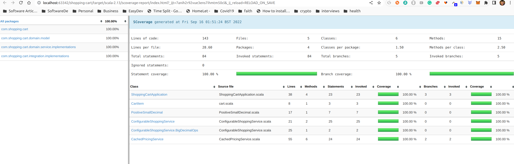

# Folder structure
* [SBT Project](project) - where sbt plugins and configurations are added
* [Source Code](src)
  * [Integration Test](src/it) - all tests which have external service integration (web api, database, kafka, etc.)
  * [Main code](src/main) - main application code 
  * [Unit Test](src/test) - all tests which do not have external integrations (these should be mocked or stubbed here)

# Package structure
Package structure for [Main Code](src/main) is: 
* [domain](src/main/scala/com/shopping/cart/domain) - here is all the business domain data structures and logic:
  * [model](src/main/scala/com/shopping/cart/domain/model) - business data structures/types;
  * [service](src/main/scala/com/shopping/cart/domain/service)  - business logic functions with inputs and outputs from the model;
  * IMPORTANT: all classes in `domain` package should be effect free, only pure functions with everything visible in their signatures, no invisible internal state modification like in OOP.
* [integration](src/main/scala/com/shopping/cart/integration)
  * all external service integrations for retrieving or pushing data, like web api calls
* NOTE: 
  * if there were to be data persistence or queuing systems, new top level packages or modules would be created;
  * if the project would become more complex, separate sbt modules could be created for the top level packages with clear one way dependency directions between them;

# SBT commands: 
  * Run tests and coverage report: ```sbt test it:test coverageReport```
    * report will be available in [root target directory](target/scala-2.13/scoverage-report/index.html);
    * it will look like:
      * 

# TODO: 
* to make `domain` package fully functional error throwing must be eliminated/wrapped and express possible failures in the signature using error indicating wrapper types like: Either, Validated, MonadError, etc.
* add 'scalafmt' to automatically format files;
* add an API layer to be possible to interact with the application;
* add acceptance, performance, smoke and security tests;
* package code as docker images for deployment in cloud (for kubernetes for example);
* add ci build and automatic testing & deployment to different environments;

# Domain model structure
## Receipt
```json
{
  "cart" : {
    "products" : [
      {
        "product" : {
          "name" : "Cornflakes",
          "price" : {
            "value" : 2.52
          }
        },
        "quantity" : 2,
        "cost" : {
          "value" : 5.04
        }
      },
      {
        "product" : {
          "name" : "Weetabix",
          "price" : {
            "value" : 9.98
          }
        },
        "quantity" : 1,
        "cost" : {
          "value" : 9.98
        }
      }
    ]
  },
  "totals" : {
    "subtotal" : {
      "value" : 15.02
    },
    "tax" : {
      "value" : 1.88
    },
    "total" : {
      "value" : 16.90
    }
  }
}
```
